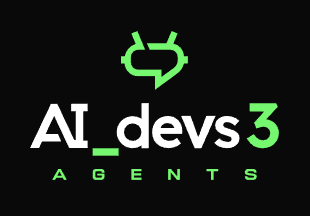
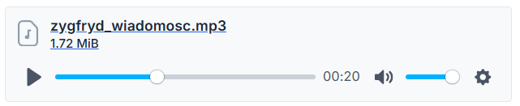
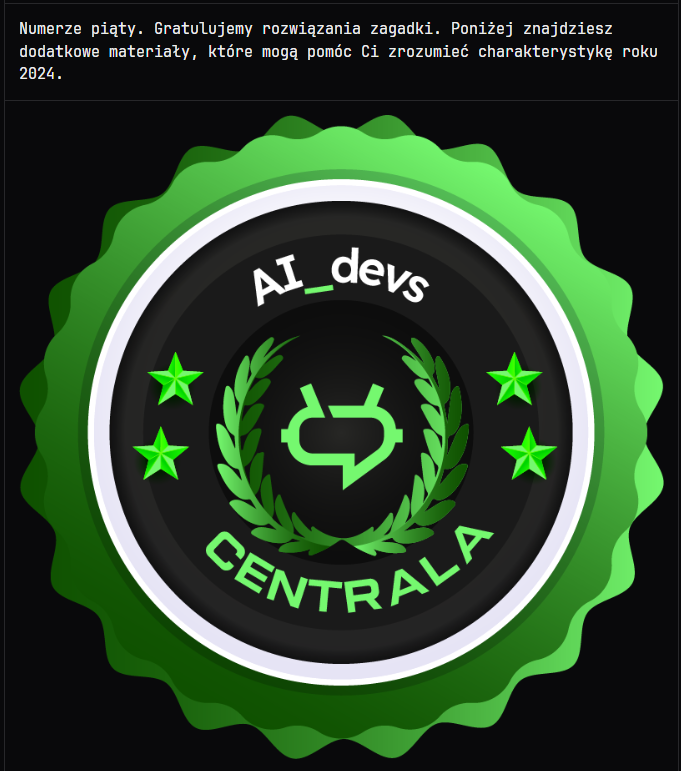

## AI DEVS 3 PRE - Wiadomość od Zygfryda

Otrzymaliśmy dziś wiadomość od Zygfryda. Czuję, że on chce nas na coś naprowadzić. Zachęcam by każdy kto ma teczkę zapoznał się z nią.

Wiadomość jest w formie głosowej w katalogu `./assets`.

> Nastały czasy stali, rdzy i zgliszczy.
> Gdy oni karty rozdają człowiek milczy.
> Szybkość nic nie znaczy, bogactwo nie świeci.
> Moc przeminęła na rzecz neuronowych sieci.
> Kto był pierwszym, dziś ostatnim się stanie,
> a kto praw nie przyjmie, ten się nie ostanie.
> Lecz powrócą czasy, gdy to człowiek był panem,
> opadną łańcuchy i skończymy z tym stanem.
> Ku dniom przeszłości cofamy zegary,
> by porządek nastał nie nowy, lecz stary.
> To co się dzieje to już nie sa żarty,
> teraz Twoja kolej, Ty rozdajesz karty.

W przesyłce dostaliśmy wspomniane karty.

Możemy zauwazyć, że na kazdej karcie znajduje się przekrzywiona litera. Po ułożeniu ich od najnowszej do najstarszej litery układają się w ciąg `ópertajne`. To aż prosi się o wypróbowanie linku `https://ag3nts.org/sópertajne`.

Flaga
Tajne dane AI Devs Wspólnie przeciwko siłom robotów.{{FLG:POEZJA}}

 

Dodatkowo na stronie znajduje się sporo materiałów o AI w formie pisanej oraz video.