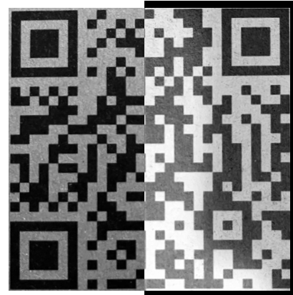

## AI DEVS 3 PRE - Materiały fizyczne

Przed rozpoczęciem misji dostaliśmy fizyczne dokumenty, które znajdują się w katalogu `./docs`.

Z tyłu mapy znajduje się kod QR z łacińskim podpisem `Speculum est reflexio veritas`.

Napis oznacza `lustro jest odbiciem prawdy`.

Rozwiązaniem jest odwrócenie kolorów prawej strony kodu QR.

Kod prowadzi na stronę `https://ag3nts.org/chronos/`.  
Znajduje się tam wiadomość:

> Tajemnica kodu QR została rozwikłana. {{FLG:WALKAZCZASEM}}