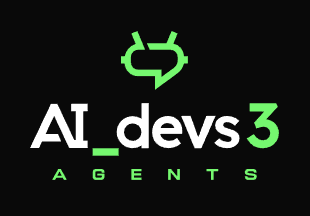

## AI DEVS 3

Repozytorium zawiera materiały do szkolenia [AI DEVS 3](https://www.aidevs.pl/).

### Wymagania projektu

* [Node 20+](https://nodejs.org/docs/latest/api/)

### Setup projektu
* Sklonuj repozytorium
* Wejdź do katalogu głównego i wykonaj polecenie `npm install` 

### Uruchamianie zadań

Poszczególne zadania możesz uruchamiać skryptami znajdującymi się w pliku `package.json`, np: `npm run day0`

### Poligon

`https://poligon.aidevs.pl/`